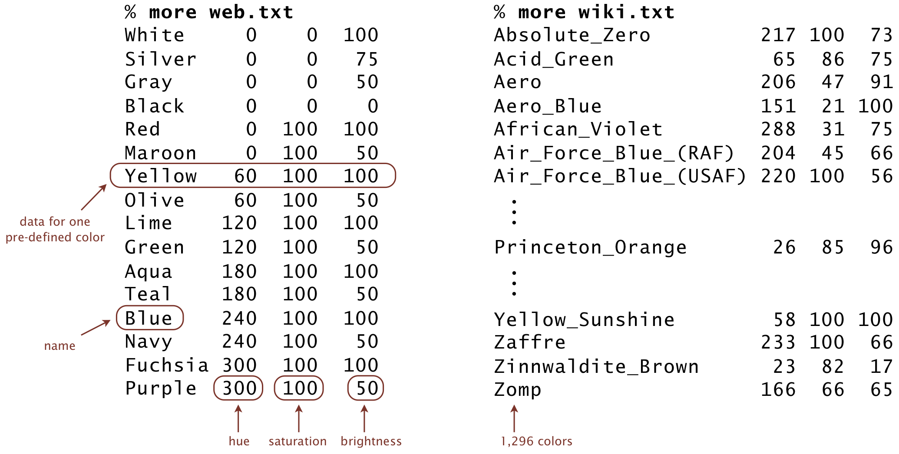

# ColorHSB - Hue-Saturation-Brightness Color Model

## What This Program Does

This Java class implements a color representation using the Hue-Saturation-Brightness (HSB) model, commonly used in color pickers and graphic design software. It provides methods for color analysis, comparison, and conversion.

## Key Features

- **HSB Color Representation**: Stores colors using hue (0-359°), saturation (0-100%), and brightness (0-100%)
- **Color Analysis**: Identifies grayscale colors
- **Color Comparison**: Calculates perceptual distance between colors
- **Input Validation**: Ensures all color components are within valid ranges
- **Color Matching**: Finds closest named color from a predefined set

## Color Model Specifications

| Component   | Range      | Description                          |
|-------------|------------|--------------------------------------|
| Hue         | 0-359°     | Color position on the color wheel    |
| Saturation  | 0-100%     | Color purity (0% = gray, 100% = vivid) |
| Brightness  | 0-100%     | Lightness (0% = black, 100% = full color) |

## How To Use

1. **Create Color Objects**:
   ```java
   ColorHSB red = new ColorHSB(0, 100, 100);    // Pure red
   ColorHSB gray = new ColorHSB(0, 0, 50);      // Medium gray
   ```

2. **Check Color Properties**:
   ```java
   if (color.isGrayscale()) {
       System.out.println("This is a grayscale color");
   }
   ```

3. **Compare Colors**:
   ```java
   int distance = color1.distanceSquaredTo(color2);
   ```

4. **Find Closest Named Color**:
   ```bash
   java ColorHSB 25 84 97 < colors.txt
   ```

## Example Color Database Files

- [web.txt](web.txt) - Common web colors
- [wiki.txt](wiki.txt) - Extended color names

<p><br>
<blockquote>

</blockquote>


## Sample Outputs

```bash
$ java ColorHSB 350 100 45 < web.txt
Maroon (0, 100, 50)

$ java ColorHSB 25 84 97 < wiki.txt
Princeton_Orange (26, 85, 96)
```

## Distance Calculation

The squared distance between two colors (h₁,s₁,b₁) and (h₂,s₂,b₂) is calculated as:
- Minimum of (h₁-h₂)² or (360-|h₁-h₂|)² (accounts for circular hue)
- Plus (s₁-s₂)²
- Plus (b₁-b₂)²

## Applications

- Graphic design tools
- Color palette generators
- Image processing applications
- UI/UX design systems
- Data visualization

## Limitations

- Only implements HSB color space (no conversion to RGB or other models)
- Basic distance metric (more advanced color difference formulas exist)
- Limited to predefined color names in input files

*Note: For professional color work, consider additional color spaces and more sophisticated difference metrics.*
